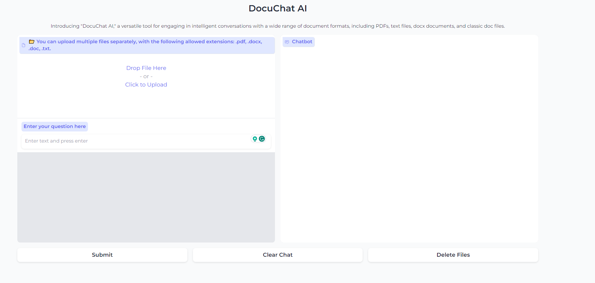

# DocuChat AI: Retrieval Augmented Generation (RAG) System

## Overview

DocuChat AI is an intelligent conversation tool powered by the Retrieval Augmented Generation (RAG) system. It seamlessly combines the capabilities of OpenAI's language model, Langchain, and Milvus to enable users to ask questions about a variety of documents without requiring fine-tuning of the Large Language Model (LLM). This system is designed to retrieve relevant documents from a specialized vector database and generate informative responses, facilitating intelligent conversations with a wide range of document formats.

## Key Features

- **Document Compatibility:** DocuChat AI supports a diverse set of document formats, including PDFs, text files, docx documents, and classic doc files. You can upload multiple documents at once.

- **RAG Integration:** Leveraging OpenAI's RAG model, the system excels at retrieving pertinent documents from the vector database to answer user queries effectively.

- **Efficient Document Processing:** The system efficiently processes uploaded documents, splitting and indexing them for optimal retrieval and generation.

- **User-Friendly Interface:** The intuitive Gradio interface allows users to interact with DocuChat AI effortlessly.

## How it Works

1. **Upload Documents:** You can upload multiple documents of various formats, including PDFs, docx, doc, and text files.

2. **Ask Questions:** Enter your questions or queries in natural language, and the system will provide informative responses.

3. **RAG Retrieval:** Behind the scenes, DocuChat AI employs the RAG model to retrieve relevant documents from the vector database based on your questions.

4. **Intelligent Responses:** The system generates intelligent responses using both the retrieved documents and the RAG model, enabling meaningful and context-aware conversations.

## How to run

1. [Install and run a Milvus instance](https://milvus.io/docs/install_standalone-docker.md)

2. Make sure you have the necessary requirements to run the Python program

    `pip install -r requirements.txt`
3. Set up your OpenAI API key by replacing `"YOUR_API_KEY"` in the `app.py` with your actual API key. You can obtain an API key by signing up at [OpenAI's platform](https://platform.openai.com/).
4. Run the chatbot:

   ```bash
   python app.py
   ```
